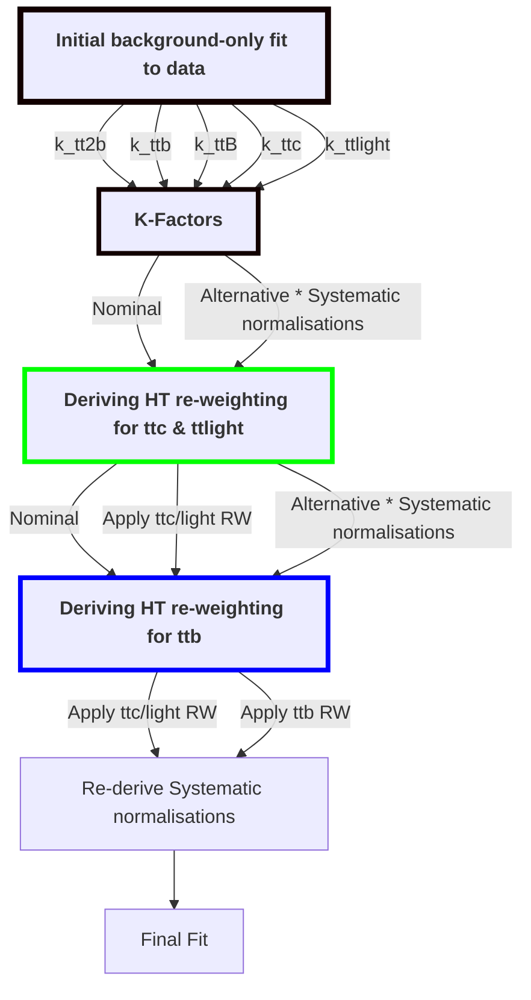

## Introduction

The goal is to reduce the data/MC mis-modelling of $HT_{all}$ for $tt+\geq{1b}$ components in the ttH(bb) full Run  Legacy analysis. The procedure used here obtains a re-weighting interpolation function that is then applied to the $HT$ distribution, through a data-driven  approach, paramterised on $HT_{all}$ and the number of final state jets, denoted ` nJets`. The $tt+\geq{1b}$ is the main contributor to background present in the signal regions.

The $HT_{all}$ observable is given by the scalar sum of the transverse momenta of all leptons and jets in the final state, shown below. 
``` math
 HT_{all} = \sum_{j}p_{T,j}^{jet} + \sum_{i}p_{T,i}^{lep}

```

Since this analysis performs a differential measurement of the signal strength in bins of the Higgs boson $p_{T}$, it is clear that this observable needs to be well-modelled, in order to have a good extrapolation of the main background components to the signal regions. The region used for deriving the parameterised interpolation function is given below in the method section.

#### Running the code :
In order to run the code, you will first need to setup the appropriate enviroment. Inside a clean shell and the cloned repository, run the following :
```
source compile.sh
```
The compilation script will setup the ATLAS enviroment, the . release of AnalysisBase and compile the reweighting code.

Recompile the code with :
```
source recompile.sh
```
To run the code :
```
reweight --configFile <path/to/config/config_file>
```
The options used in the code are steered by a configuration file, with the following options available for configuration:

| Option Name             | Description |
| ---                                 | ---                   |
|  basePath                  |     The path to the directory with the MC and data ntuples for reweighting                    |
|  weight                       |  weight string to apply to MC                      |
|   selection                  |  pre-selection you would like to apply to the MC and data samples                      |
|   reweightVar             |  The name of the observable you want to reweight                       |
|   minBinWidth            |   The minimum width of the bin used in the region, e.g  GeV for the case of reweighting HT                      |
|   outputFile                |   The name of the output .root file containing the re-weighting factors, stored as a vector.                  |
|     reweightSample                               |   The samples you would like to be used in the reweighting                      |
| constSample | The samples you would like to keep constant in the calculation |
| ttbb_selection|  Apply a selection to the ttbb sampe for only ttbb HF events|
| ttc_selection  | Apply a selection to the ttbar sampe for only ttc HF events |
| ttlight_selection | Apply a selection to the ttbar sampe for only ttlight HF events |
| ttbar_Reweight| Apply weight string for ttc/ttlight reweighting in ttbb derivation |
| NormFactor_ttc |  Apply Post-fit normalisation scaling to ttc sample |
| NormFactor_ttb |  Apply Post-fit normalisation scaling to ttb/B sample |
| NormFactor_ttbb |  Apply Post-fit normalisation scaling to ttbb sample |
| NormFactor_ttlight |  Apply Post-fit normalisation scaling to ttlight sample |

The configs directory contains configuration files for both 1l and 2l. Included in these, are configuration files for the derivation w.r.t the nominal samples, and the alternative samples that are used as systematic variations. 

Inside the output directory, you will find a python script `root_to_txt.py` that will convert the .root file output to a .txt file, that is to be used in the Reweighting tool for the level  ntuple productions, such that the re-weigthing will be available as a weight that can be applied. https://gitlab.cern.ch/atlasHTop/TTHbbAnalysis/-/tree/master/ReweightingTool

#### Method :
Due to the loose pre-selection the analysis utilises, finding an orthogonal region appropriately enriched in $tt +\geq1b$ components to derive these re-weighting factors is difficult, in contrast to the approach for $tt +\geq1c$ and $tt +$light.  As such, the first bins from the following control regions were removed from the profile likelihood fit and combined, in order to generate a new orthogonal region. Since these bins are not very pure in each relevant component of $tt +\geq1b$, the overall effect on the results of the backrgound-only fit to data and fit to Asimov data are minimal.

- the $tt + B$ region
- the  $tt + 1b$  region
- the $tt +\geq 2b$ region

This region is defined through the following selection :

###### For Single-lepton
```
selection = (((L2_Class_tt1b_fraction >=0.19 && L2_Class_tt1b_fraction <= 0.3549 && L2_Class_class == 1) || (L2_Class_tt2b_fraction >= 0.19 && L2_Class_tt2b_fraction <= 0.521 && L2_Class_class == 3) || (L2_Class_tt1B_fraction >= 0.19 && L2_Class_tt1B_fraction<=0.349 && L2_Class_class == 2)))
```

###### For Dilepton
```
selection = (((L2_Class_tt1b_fraction >=0.19 && L2_Class_tt1b_fraction <= 0.3548 && L2_Class_class == 1) || (L2_Class_tt2b_fraction >= 0.19 && L2_Class_tt2b_fraction <= 0.418 && L2_Class_class == 3) || (L2_Class_tt1B_fraction >= 0.19 && L2_Class_tt1B_fraction<=0.3489 && L2_Class_class == 2)))
```
Here, the `DeepSets_class` refers to the output class of the multi-class classifcation transformer used in the analysis, and is used to remove any overlaps when forming this new region.

-----------------------------------

For the derivation of the factors, only the tt$+\geq1b$ samples are used. The other samples are removed from the MC, and an equal amount is then subtracted from the data ( i.e we multiply the weights by - and combine with the data samples.)

On top of the selection above, it should be noted the intial pre-selection for the region is defined by
```
5j3b@ for Single Lepton, 3j3b@,2b@ for Dilepton
```
The bins of the distribution in the newly defined orthogonal region used in the re-weighting procedure, that is performed bin-by-bin, are selected based on the following conditions :

- each bin should contain 750 events
- each bin should be at least 40 GeV wide

-----------------------------------

The MC samples are first normalised to have the same total as data*, where data* is the data distribution after removing samples other than  tt$+\geq1b$. The re-weighting factors, $k_{i}$, are then taken from the ratio between data* and MC

``` math
 k_{i} = \frac{\text{data*}_{i}}{MC_{i}}

```

In order to make sure there is a smooth transition between consecutive bins, a smooth function, $\mathcal{f}(HT)$, is chosen for the reweigthing, as opposed to constant factors in each bin.

A piecewise function composed of $2^{nd}$ order polynomials in each bin is used. This is also required to be continous and have a continous first order derivative. Requiring the piecewise function to be continuous and have a continuous first-order derivative ensures that the resulting smooth curve is well-behaved and does not have any abrupt changes or discontinuities that could introduce artifacts or biases into the reweighting, thus we ensure that the values of the function are smoothly connected across the bin boundaries, resulting in a smooth curve that accurately represents the underlying distribution.

This is given by :

``` math
 {f}(HT) = a_{i}HT^{} + b_{i}HT + c_{i}

```

Finally, due to the condition of the number of events in each bin should be the same using the smooth reweighting, we get the following :

``` math
k_{i}\sum_{j}w_{j} = \sum_{j}(a_{i}HT^{} + b_{i}HT + c_{i})w_{j} \; \; \; \; \text{for} \;  j \in { \text{events in bin} \; i }

```
This sets up a system of linear equations that is solved for $a_{i}$, $b_{i}$ and $c_{i}$.

-----------------------------------

Due to the known mismodelling of the flavour composition in the 4FS and 5FS scheme tt samples, a scaling is applied to the ttc,ttb,ttB and ttbb samples. These scale factors are derived from a background-only fit to data, in which the relevant component normalisations are free-floated. These are outlined below.

| Flavour Components | Nominal K-factor | Uncertainty |
| ------          | ----- | -----
| 1l : $tt +\geq2b$    | 0.96  | +0.14<br>−0.12
| 1l : $tt +\geq1c$    | 1.79  | +0.25<br>−0.23
| 1l : $tt + 1b/B$     | 1.08  | +0.14<br>−0.13
| 1l : $tt + light$    | 0.74  | +0.10<br>−0.10
| 2l : $tt +\geq2b$    | 0.93  | +0.15<br>−0.13
| 2l : $tt +\geq1c$    | 1.59  | +0.22<br>−0.20
| 2l : $tt + 1b/B$     | 1.29  | +0.22<br>−0.20
| 2l : $tt + light$    | 0.85  | +0.17<br>−0.15

Note : Re-derive with fake factor fakes estimation

Some alternatives to this approach would be using Kernal Density Estimation (KDE) techniques, or using a ML algorithm to learn a mapping between the data and MC distributions.

Alternartive interpolation functions could also be used, e.g

- Radial Basis Functions (RBF): RBF interpolation uses radial basis functions, such as Gaussian functions or inverse multiquadrics, to interpolate data. RBFs can handle irregularly spaced data and provide smooth interpolations.
- Kriging: Kriging, also known as Gaussian process regression, is a statistical interpolation technique that models the data as a random process. It can capture complex spatial correlations and provide uncertainty estimates for the interpolated values.


#### Basic Workflow 

